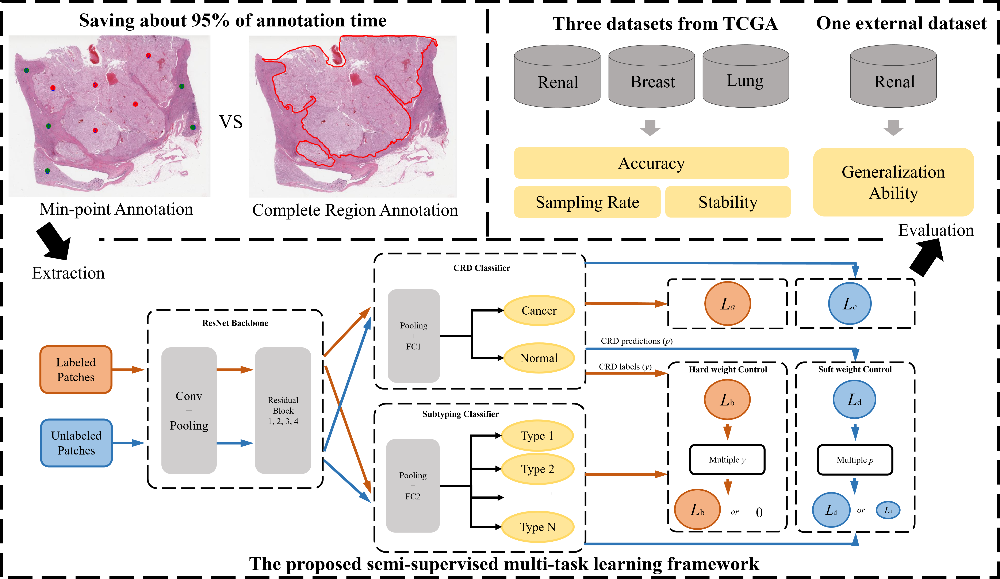

# SSMTL_CancerClassification
The source code of paper in Medical Image Analysis **A Semi-Supervised Multi-Task Learning Framework for Cancer Classification with Weak Annotation in Whole-Slide Images**

A semi-supervised multi-task learning (SSMTL) framework for cancer classification. 

Our framework consists of a backbone feature extractor, two task-specific classifiers, and a weight control mechanism.

The backbone feature extractor is shared by two task-specific classifiers, such that the interaction of CRD and subtyping tasks can be captured. 

The weight control mechanism preserves the sequential relationship of these two tasks and guarantees the error back-propagation from the subtyping task to the CRD task under the MTL framework.

We train the overall framework in a semisupervised setting, where datasets only involve small quantities of annotations produced by our minimal point-based (min-point) annotation strategy.

## Requirements
- Python 3.6+
- torch 1.7.0
- torchvision 0.8.1
- tensorboardX 2.1
- numpy 1.21.5
- progress 1.5

## Dataset
- Download the TCGA datasets, including renal, lung and breast from [this link](https://dataset.chenli.group/home/rcc-region-and-subtyping)

## Usage

### Pre-processing
1. Generate Binary Mask for WSIs `./preprocess/back_ground_filter.py`.
2. Extract Image Patches from WSIs (no-overlapping) `./preprocess/extract_patches.py`.

### Training
1. Set up pathes of labeled, unlabeled training data and valid data in line 78-80 of `multitask_train.py`.

    For example:

    `labeled_data_files = "./data/RCC/labeled_2000_train.txt"`

    `unlabeled_files = "./data/RCC/unlabeled_2000_train.txt"`
    
    `test_files =  "./data/RCC/all_2000_test.txt"`

2. Run `python multitask_train.py --gpus 0,1 --epoches 200 --batch-size 128 --n-classes1 2 --n-classes2 3 --out your_path_to_save`.

#### Note that, `n-classes1` and `n-classes2` represent the number of classes for CRD and subtyping classifier, respectively.

### Prediction
1. Set up pathes of test data, model and results (you want to save).

    For example:
    
    test_files = "./data/RCC/all_2000_test.txt"
    
    file_path_base = "./path_to_model/model_best.pth.tar"
    
    results_file = "./data/results.csv"

2. Run `python valid.py`

### Evaluation
Use the corresponding jupyter notebooks (`Evaluation_SSMTL_CRD.ipynb` and `Evaluation_SSMTL_Subtyping.ipynb`) to evaluation the cancer region detection and subtyping tasks, respectively.

## Citation

If any part of this code is used, please give appropriate citation to our paper.

## Authors
- Zeyu Gao (betpotti@gmail.com)
- Chen Li (cli@xjtu.edu.cn)

## Institute
[BioMedical Semantic Understanding Group](http://www.chenli.group/home), Xi'an Jiaotong University.

## License
This project is licensed under the MIT License - see the [LICENSE](./LICENSE) file for details.

## Acknowledgements
The datasets used are in whole or part based upon data generated by [the TCGA Research Network](https://www.cancer.gov/tcga).

We have great thanks to the implementation of MixMatch by [YU1ut](https://github.com/YU1ut/MixMatch-pytorch).
